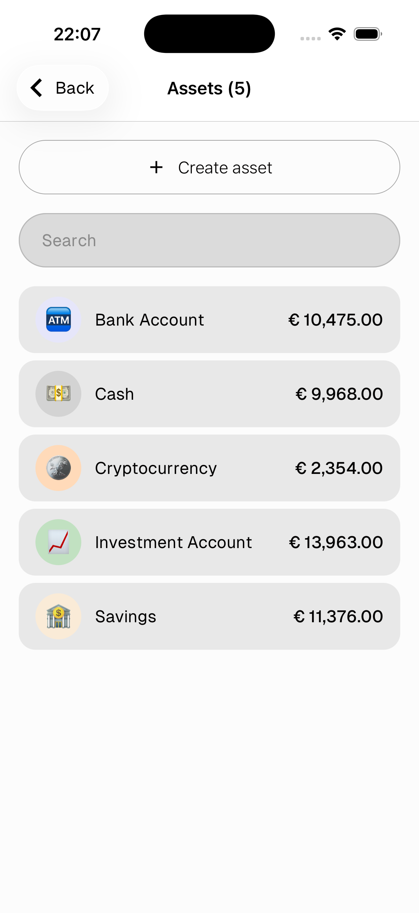
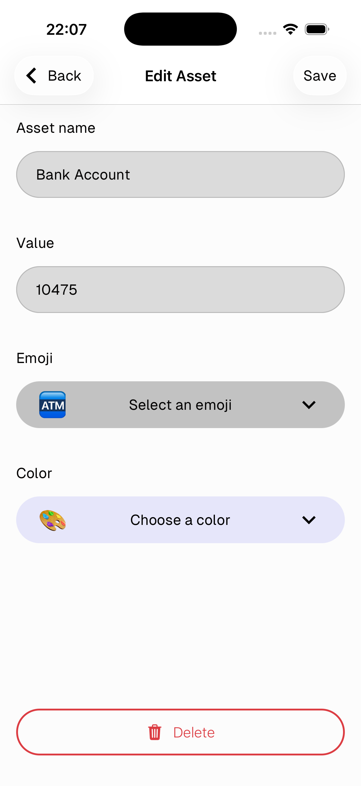

# Assets

Assets represent your money accounts — cash, bank accounts, savings, crypto, or anything else you want to track. Every transaction is linked to an asset, and its value updates automatically when you add or delete transactions.

---

## Asset list

Go to **Settings → Inventory → Assets** to see all your assets and their current values.

- Tap **+ Create asset** to add a new one
- Tap any asset to edit it

---

## Create / Edit an asset

- **Asset name** — e.g. Cash, Bank Account, Savings
- **Value** — the current balance
- **Emoji** — icon for the asset
- **Color** — background color of the badge

Tap **Save** to confirm.

> Tap **Delete** to remove the asset.