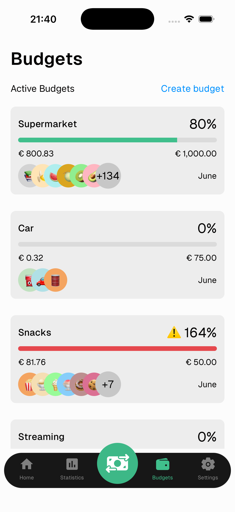
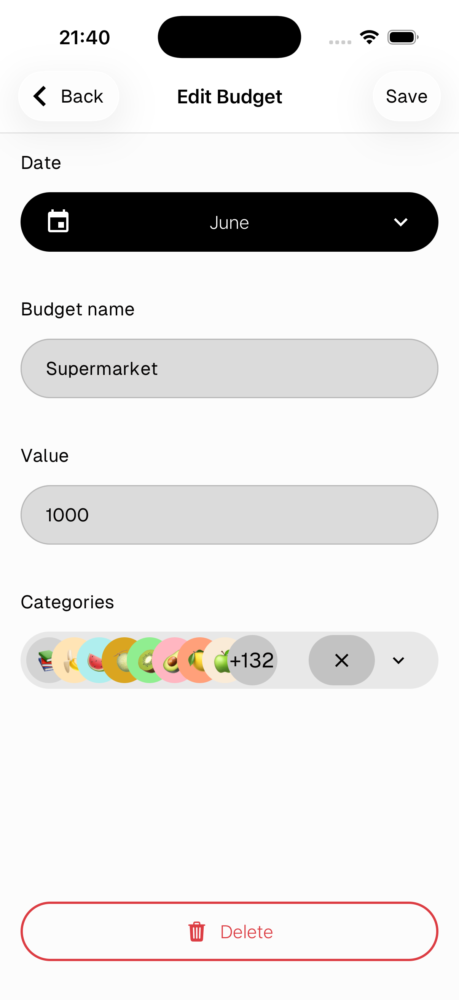

# Budget

Budgets let you set a spending limit for a group of categories and track it in real time.

---

## Budget list

Each budget card shows:
- **Name** and **spending percentage**
- **Progress bar** — green when under budget, red with ⚠️ when over
- **Amount spent** vs **budget limit**
- **Categories** included in the budget
- **Month** the budget applies to

> Tap any budget card to edit it.

---

## Create a budget

Tap **Create budget** in the top right of the Budgets screen.

---

## Edit a budget

- **Date** — the month this budget applies to
- **Budget name** — a label to identify it
- **Value** — the spending limit
- **Categories** — tap to select which categories count toward this budget

Tap **Save** in the top right to confirm.

> Tap **Delete** at the bottom to remove the budget.