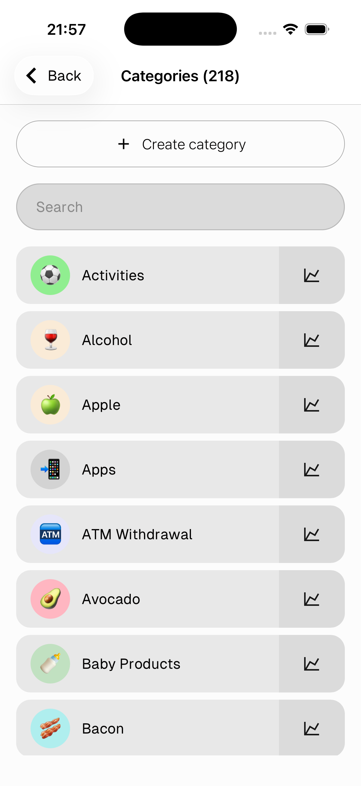
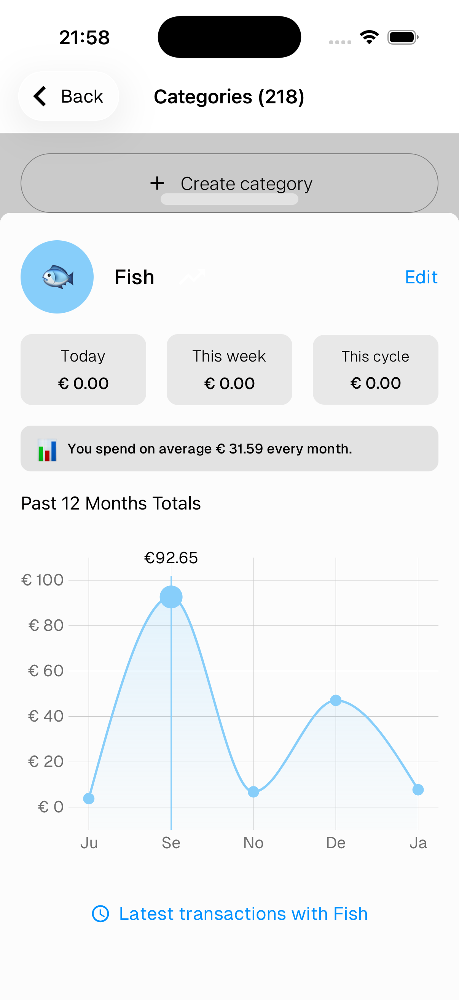
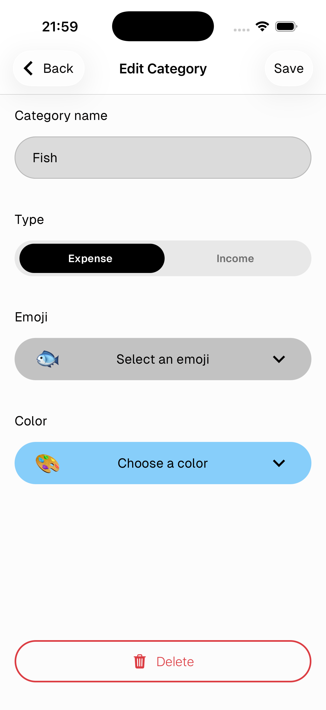

# Categories

Categories are used to classify every item in a transaction. Each category belongs to a type — **Expense** or **Income** — and only shows up when creating the matching type of transaction.

---

## Category list

Go to **Settings → Inventory → Categories** to see all your categories.

- Tap **+ Create category** to add a new one
- Use the **Search** bar to find a category quickly
- Tap the **chart icon** on the right to view spending stats for that category

---

## Category stats

- **Today / This week / This cycle** — spending totals for the category
- **Monthly average** — how much you spend on this category per month on average
- **Past 12 months** — a line chart of spending over the last year
- Tap **Latest transactions** at the bottom to see all transactions with this category

Tap **Edit** to edit the category.

---

## Create / Edit a category

- **Category name** — the label shown everywhere in the app
- **Type** — Expense or Income. This determines when the category appears during transaction creation
- **Emoji** — the icon shown on the category badge
- **Color** — the background color of the badge

Tap **Save** to confirm.

> Tap **Delete** at the bottom to remove the category.