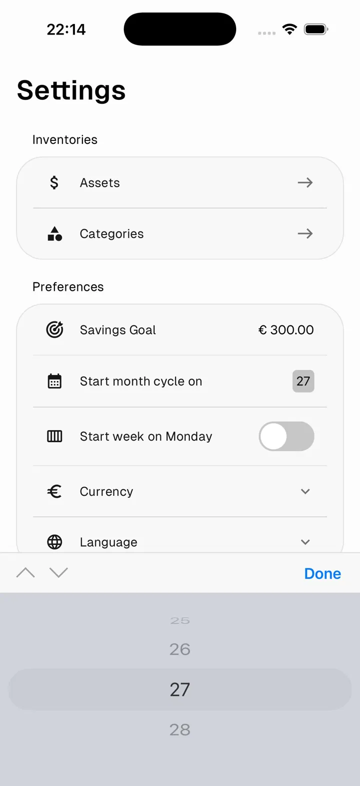

# Monthly Cycle

The monthly cycle defines **when your financial month starts and ends**. By default most apps use calendar months (1st to 31st) — but that rarely matches how people actually get paid or manage money.

In Numeroo, you can set any day of the month as your cycle start. Every part of the app — statistics, spending pace, budgets, home screen totals — respects this date.

> For example, if you set the cycle to start on the **27th**, your month runs from the 27th of one month to the 26th of the next.

---

## Set your cycle start day

Go to **Settings → Preferences → Start month cycle on**.

Scroll the picker to select the day your financial month begins.

Tap **Done** to confirm.

---

## Start week on Monday

Also in Preferences, you can toggle **Start week on Monday** to align weekly spending limits and statistics with your preferred week start day.