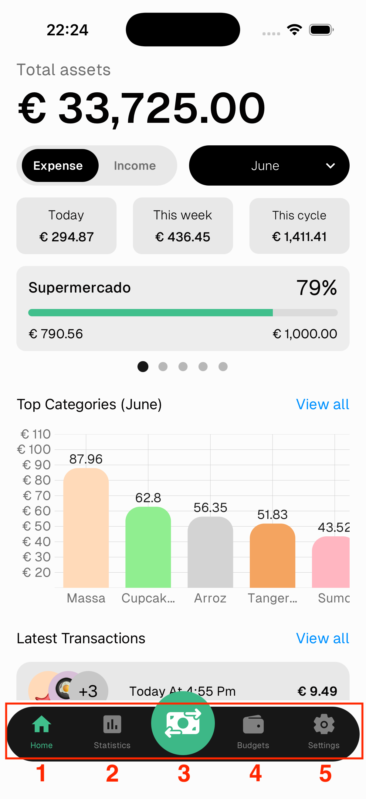
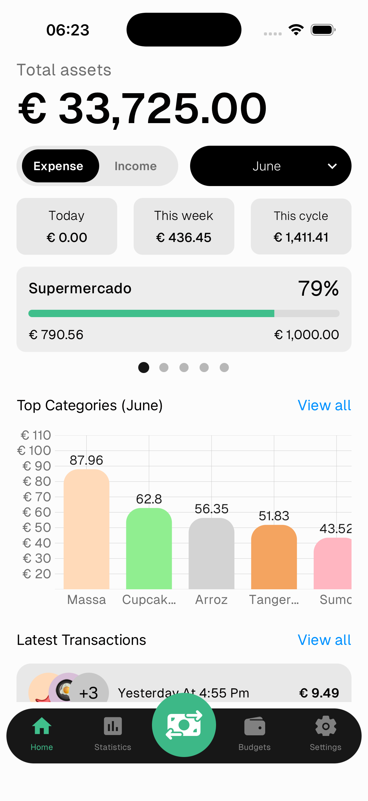

# Navigation

1. **Home** — your financial dashboard
2. **Statistics** — spending pace, trends and charts
3. **Add** — scan a receipt with AI or add a transaction manually
4. **Budgets** — manage and monitor budgets per category
5. **Settings** — account, assets, categories and preferences

---

## Home Screen

- **Total assets** — sum of all your assets
- **Expense / Income toggle** — switch between viewing expenses or income for the selected period
- **Date range** — filter by this cycle, this month, custom range, etc.
- **Expense/Income summary** — when viewing the current month, shows today, this week, and this cycle totals. For custom date ranges or past cycles, shows a single total for the selected period
- **Budget cards** — swipeable cards showing spending vs budget per category. Red bar means over budget ⚠️
- **Top Categories** — bar chart of your biggest spending categories. Tap **View all** for the full list
    >💡 Press any bar in the **Top Categories** chart to see detailed spending stats for that category.
- **Latest Transactions** — your most recent records. Tap **View all** to see everything