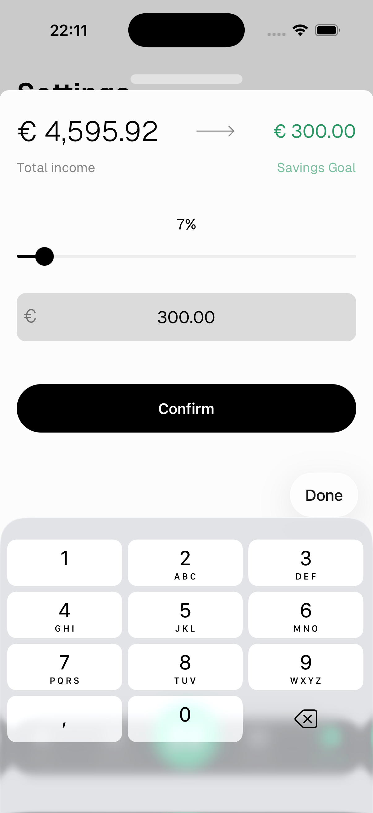

# Savings Goal

The savings goal is the minimum amount you want to save each cycle. It drives the **Spending Pace** calculations in Statistics, showing whether you're on track to meet it.

---

## Set your savings goal

Go to **Settings → Preferences → Savings Goal**.

- **Slider** — drag to set the goal as a percentage of your total income
- **Input field** — type a specific amount directly

The percentage and amount update together in real time.

Tap **Confirm** to save.