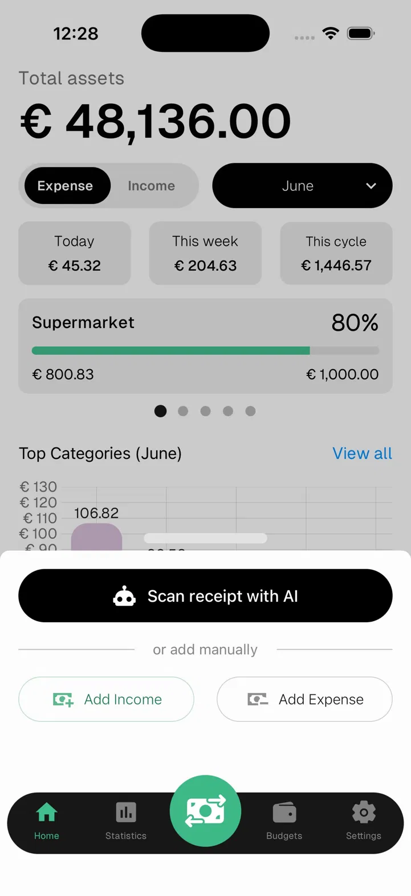
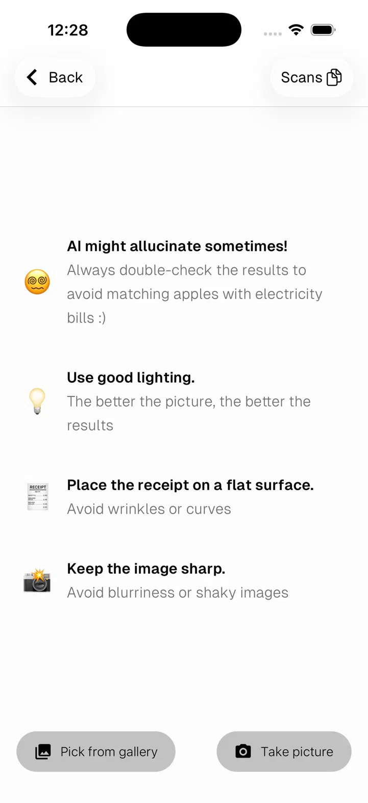
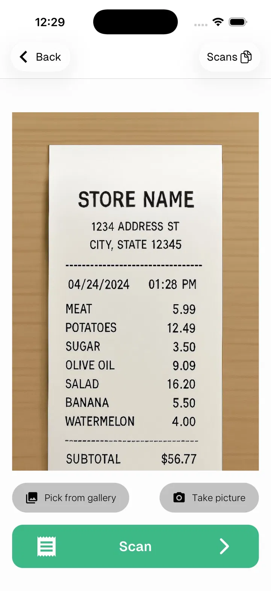
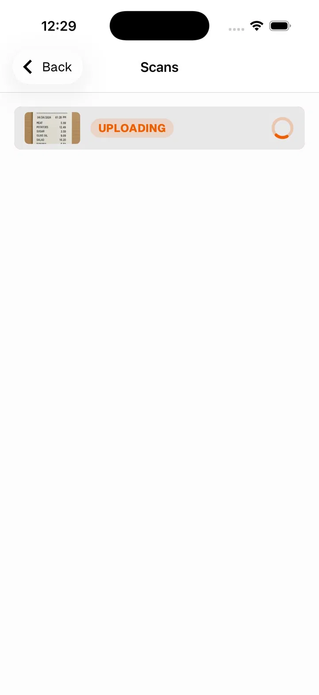
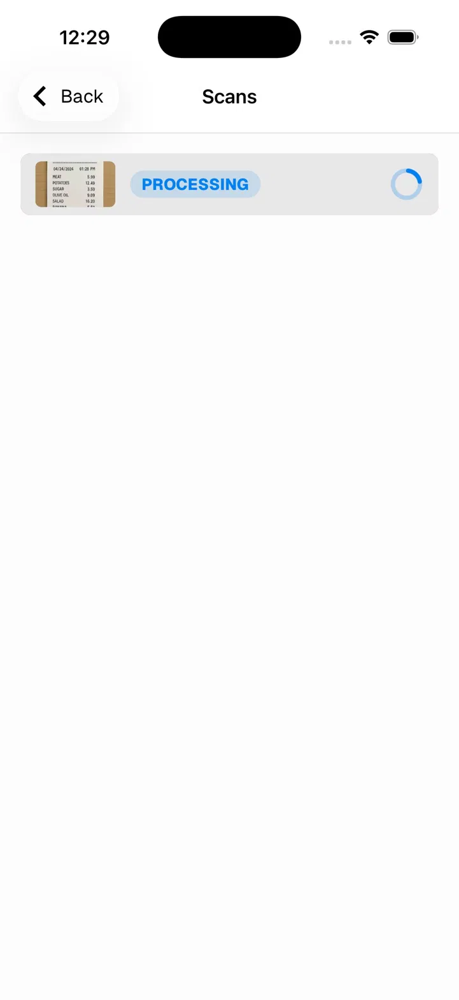
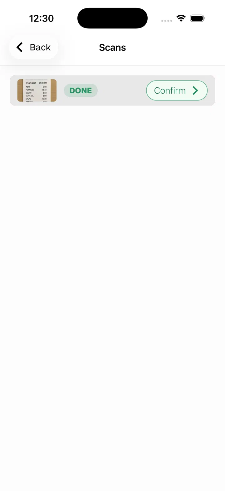
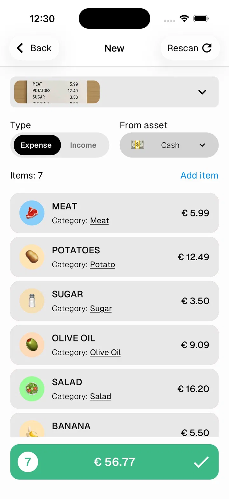
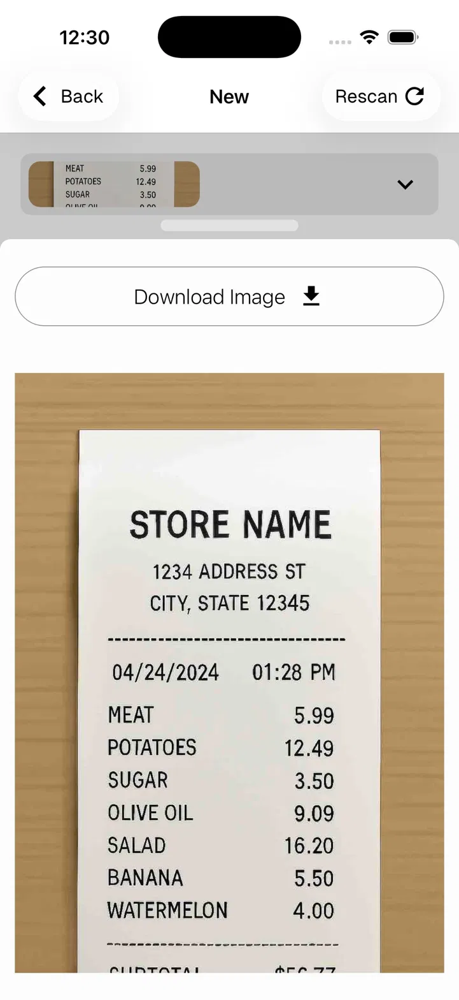

# Scan Receipt with AI

Numeroo can read a receipt photo and automatically extract all items and values, saving you from entering them manually.

---

## Start a scan

1. Tap the **green ⇄ button** in the center of the bottom bar
2. Tap **Scan receipt with AI**

---

## Take or pick a photo

- Tap **Take picture** to use your camera
- Tap **Pick from gallery** to choose an existing photo

> 😵 AI might hallucinate sometimes — always double-check the results
> 💡 Use good lighting — the better the picture, the better the results
> 🧾 Place the receipt on a flat surface — avoid wrinkles or curves
> 📷 Keep the image sharp — avoid blurriness or shaky images

---

## Review before scanning

Once a photo is selected it appears in preview. Tap **Scan →** to send it to the AI.

---

## Processing

The receipt goes through two stages — **Uploading** then **Processing**. You can close the app and come back — the scan runs in the background.

> Tap **Scans** in the top right at any time to check the status of pending scans.

---

## Confirm the results

When the scan is **Done**, tap **Confirm →** to review the extracted items.

---

## Review and save

The AI extracts all items from the receipt and matches them to your categories automatically. You can:

- Tap any item to change its category or value
- Tap **Add item** to add a missing item
- Swipe left to delete an item
- Tap **Rescan** in the top right if the results look wrong

Tap the **green bar** ✓ to confirm and set the date.

---

## View the original receipt

Tap the receipt thumbnail at the top to expand and view the original photo at any time.