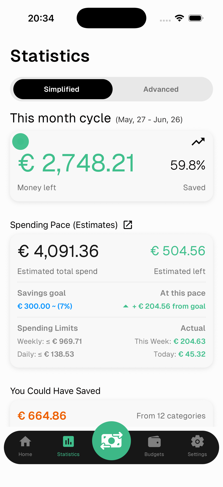
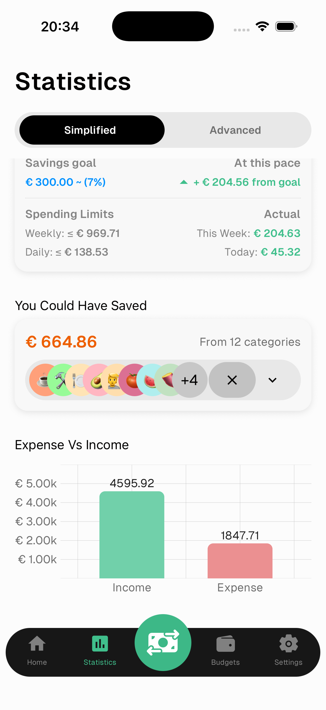
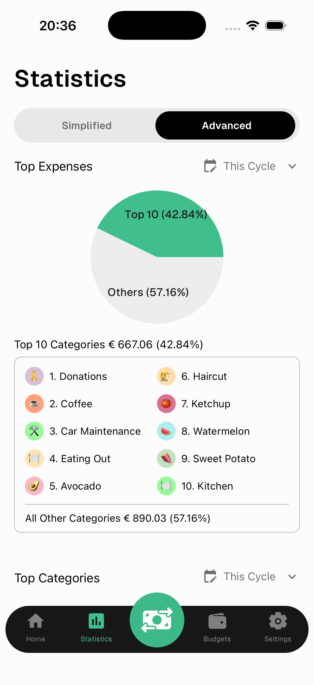
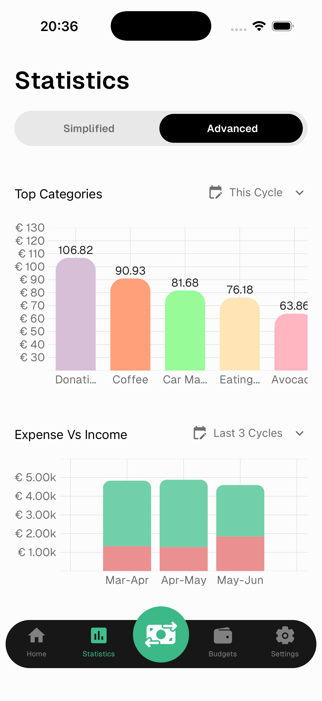

# Statistics

The Statistics screen gives you a deep view of your financial health. Toggle between **Simplified** and **Advanced** at the top.

---

## Simplified

### This Month's Cycle

- **Money remaining** — how much you have left after expenses this cycle
- **Saved %** — percentage of your income saved so far

### Spending Pace

The most powerful tool in Numeroo. Based on your current spending rhythm, it estimates how the rest of the month will look.

- **Estimated total expense** — projected spending by end of cycle
- **Estimated remaining** — projected money left
- **Savings goal** — your target and whether you're on track
- **At this pace** — how much above or below your savings goal you'll end up if you keep spending at this rate
- **Weekly / Daily limits** — maximum you should spend to stay on track
- **This week / Today** — what you've actually spent

> Green means you're ahead of your goal. Red means you're overspending.

---

### Could Have Saved

Shows how much you could have saved based on the average spending of your top categories. Tap the arrow to expand and see which categories have room to cut.

### Expense vs Income

A bar chart comparing your total expenses and income for the selected period.

---

## Advanced

### Top Expenses

A pie chart showing your top 10 categories vs all others. Use the date filter to change the period.

### Top Categories

A bar chart of your highest spending categories for the selected period.

---

### Expense vs Income

A stacked bar chart comparing expenses and income across the last 6 cycles. Useful for spotting trends over time.