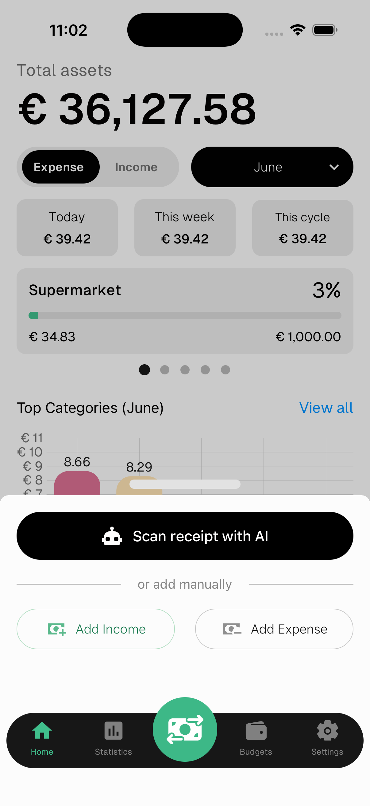
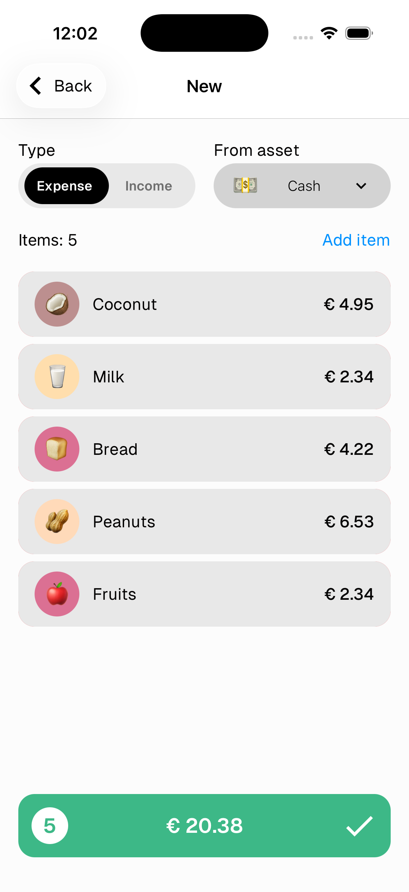
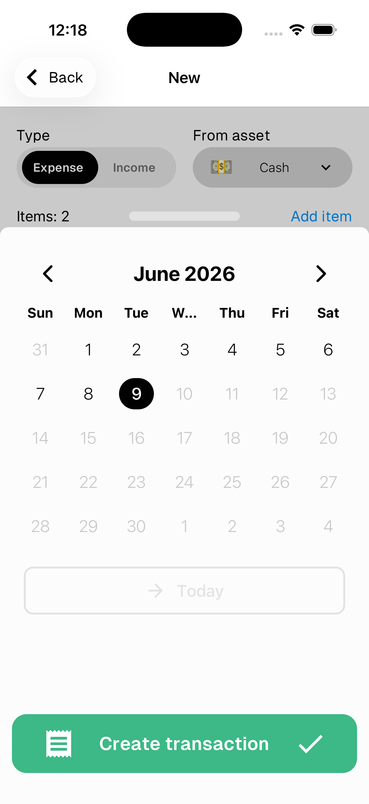
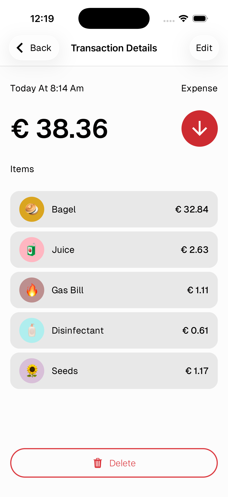
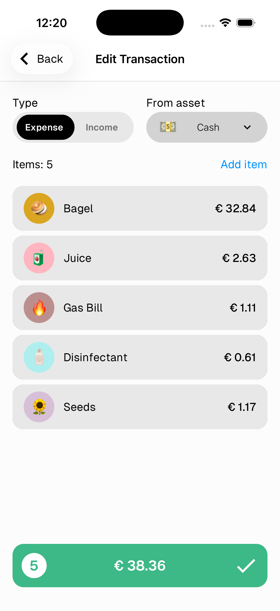
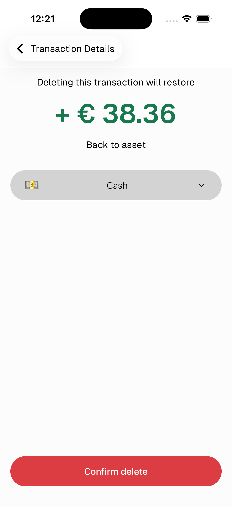

# Transactions

A transaction is a record of money going out (expense) or coming in (income). Each transaction contains one or more items, each assigned to a category.

> To create a transaction by scanning a receipt, see the [Scan Receipt](#) guide.

---

## Create a transaction

1. Tap the **green ⇄ button** in the center of the bottom bar
2. Choose **New Expense** or **New Income**

---

## Add items

1. Select the **type** (Expense or Income) and the **asset** it comes from
2. Tap **Add item** to add an item
3. Select a **category** and enter the **value**
4. Repeat for multiple items — each item can have its own category

> Swipe left on an item to delete it

---

## Confirm and set the date

1. Tap the **green bar** at the bottom showing the total
2. Pick the **date** — tap **Today** to quickly select today
3. Tap **Create record** ✓

---

## View details

Tap any transaction from the home screen or transactions list to see its full details — date, type, asset, all items and their categories.

- Tap **Edit** in the top right to edit the transaction
- Tap **Delete** at the bottom to delete it

---

## Edit a transaction

The edit screen works the same as create — you can change the type, asset, add or remove items and their values.

> Changing the type (Expense ↔ Income) will clear all current items since categories are type-specific.

Tap the **green bar** ✓ to save the changes.

---

## Delete a transaction

Tap **Delete** at the bottom of the transaction details.

The amount will be automatically restored to your asset on deletion.

Tap **Confirm deletion** to proceed.