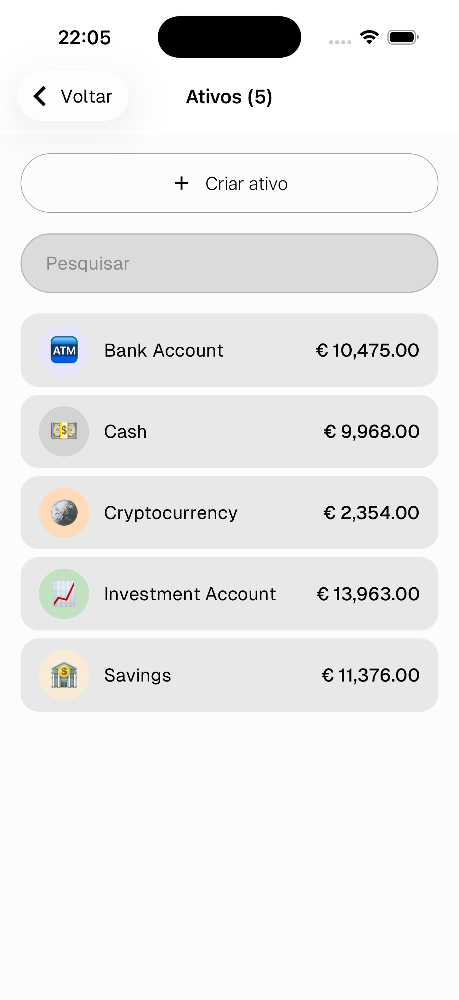
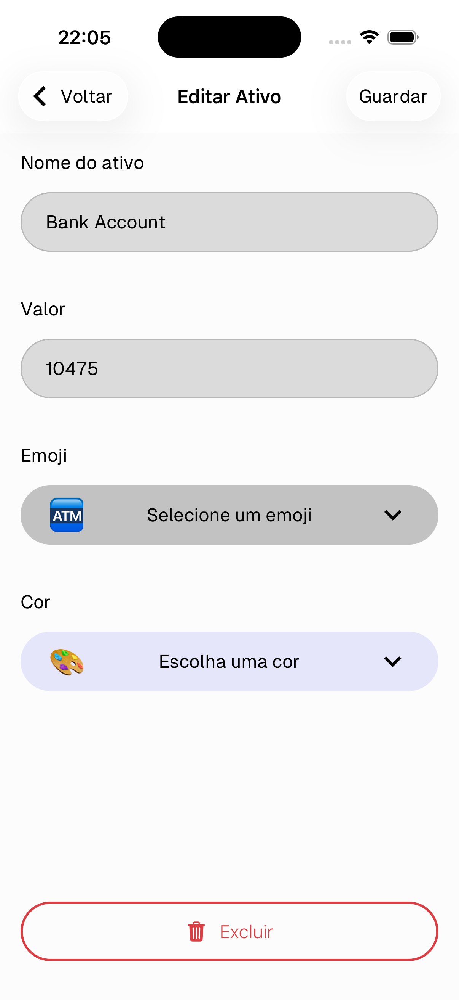

# Ativos

Os ativos representam as tuas contas de dinheiro — dinheiro, contas bancárias, poupanças, cripto, ou qualquer outra coisa que queiras acompanhar. Cada registo está ligado a um ativo, e o seu valor atualiza automaticamente quando adicionas ou eliminas registos.

---

## Lista de ativos

Vai a **Configurações → Inventário → Ativos** para ver todos os teus ativos e os seus valores atuais.

- Toca em **+ Criar ativo** para adicionar um novo
- Toca em qualquer ativo para o editar

---

## Criar / Editar um ativo

- **Nome do ativo** — ex: Dinheiro, Conta Bancária, Poupança
- **Valor** — o saldo atual
- **Emoji** — ícone para o ativo
- **Cor** — cor de fundo do distintivo

Toca em **Guardar** para confirmar.

> Toca em **Excluir** para remover o ativo.