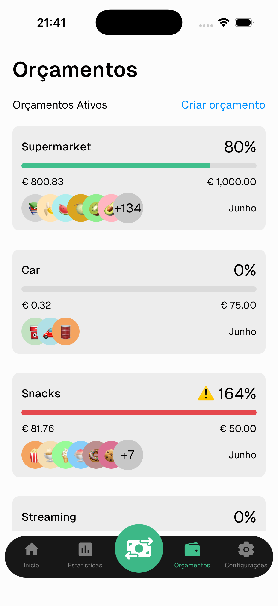
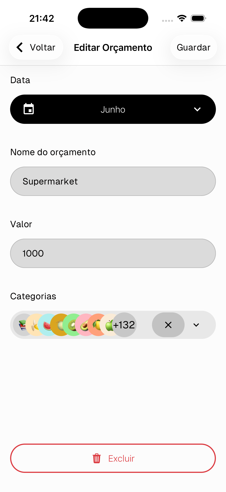

# Orçamento

Os orçamentos permitem definir um limite de gastos para um grupo de categorias e monitorizá-lo em tempo real.

---

## Lista de orçamentos

Cada cartão de orçamento mostra:
- **Nome** e **percentagem de gastos**
- **Barra de progresso** — verde quando abaixo do limite, vermelha com ⚠️ quando excedido
- **Valor gasto** vs **limite do orçamento**
- **Categorias** incluídas no orçamento
- **Mês** a que o orçamento se aplica

> Toca em qualquer cartão de orçamento para o editar.

---

## Criar um orçamento

Toca em **Criar orçamento** no canto superior direito do ecrã de Orçamentos.

---

## Editar um orçamento

- **Data** — o mês a que este orçamento se aplica
- **Nome do orçamento** — um rótulo para o identificar
- **Valor** — o limite de gastos
- **Categorias** — toca para selecionar quais as categorias que contam para este orçamento

Toca em **Guardar** no canto superior direito para confirmar.

> Toca em **Eliminar** no fundo para remover o orçamento.