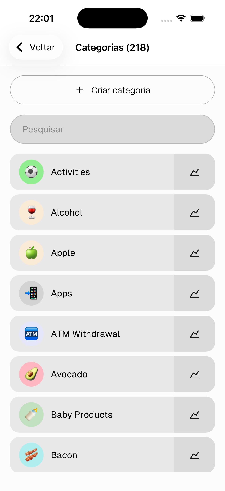
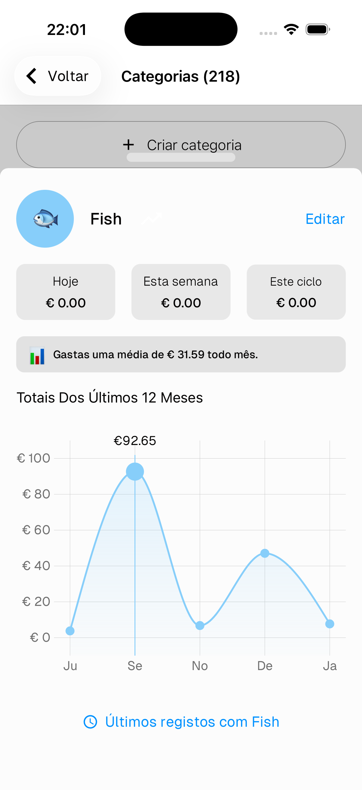
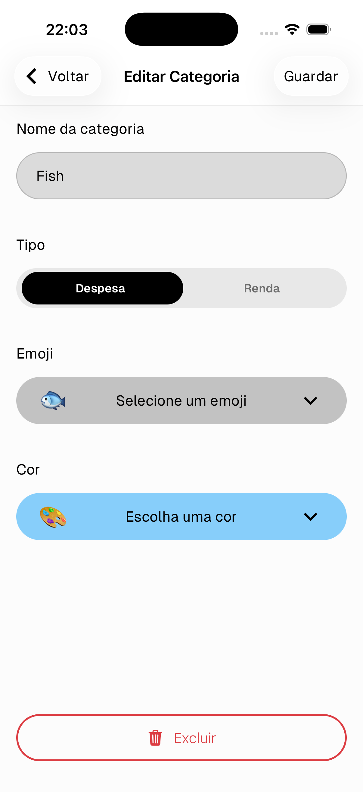

# Categorias

As categorias são usadas para classificar cada item num registo. Cada categoria pertence a um tipo — **Despesa** ou **Renda** — e só aparece ao criar o tipo de transação correspondente.

---

## Lista de categorias

Vai a **Configurações → Inventário → Categorias** para ver todas as tuas categorias.

- Toca em **+ Criar categoria** para adicionar uma nova
- Usa a barra de **Pesquisa** para encontrar uma categoria rapidamente
- Toca no **ícone de gráfico** à direita para ver as estatísticas de gastos dessa categoria

---

## Estatísticas da categoria

- **Hoje / Esta semana / Este ciclo** — totais de gastos para a categoria
- **Média mensal** — quanto gastas nesta categoria por mês em média
- **Últimos 12 meses** — um gráfico de linha dos gastos ao longo do último ano
- Toca em **Últimos registos** no fundo para ver todos os registos com esta categoria

Toca em **Editar** para editar a categoria.

---

## Criar / Editar uma categoria

- **Nome da categoria** — o rótulo mostrado em todo o lado na aplicação
- **Tipo** — Despesa ou Renda. Determina quando a categoria aparece durante a criação de registos
- **Emoji** — o ícone mostrado no distintivo da categoria
- **Cor** — a cor de fundo do distintivo

Toca em **Guardar** para confirmar.

> Toca em **Eliminar** no fundo para remover a categoria.