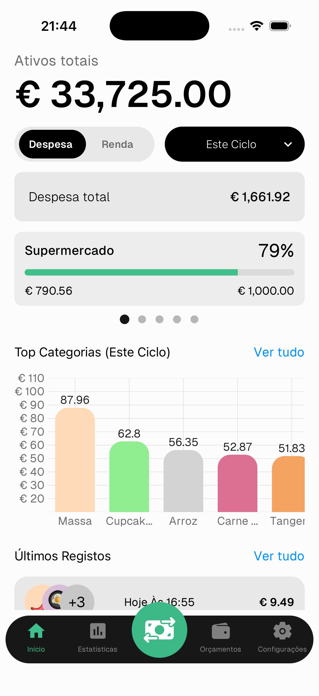

# Começar com o Numeroo

O Numeroo é uma aplicação de finanças pessoais que regista as tuas despesas e rendimentos — com **digitalização de recibos por IA** que lê e importa os teus recibos automaticamente.

## O que podes fazer

- 📸 Digitalizar recibos com IA e importar itens instantaneamente
- 💸 Registar despesas e rendimentos manualmente
- 📊 Analisar padrões de despesa com estatísticas detalhadas
- 💰 Definir orçamentos por categoria e monitorizá-los em tempo real
- 🏦 Gerir vários ativos (dinheiro, contas bancárias, carteiras)
- 🎯 Definir uma meta de poupança e acompanhar o progresso
- 📅 Escolher o dia de início do teu ciclo mensal

## Como navegar

- 🏠 **Início** — visão geral das tuas finanças
- 📊 **Estatísticas** — ritmo de despesa, tendências e gráficos
- ⇄ **Botão central** — adicionar um registo ou digitalizar um recibo
- 📂 **Orçamento** — orçamentos por categoria
- ⚙️ **Configurações** — conta, ativos, categorias e preferências

> Cada secção tem o seu próprio guia — usa a lista de guias para saber mais.