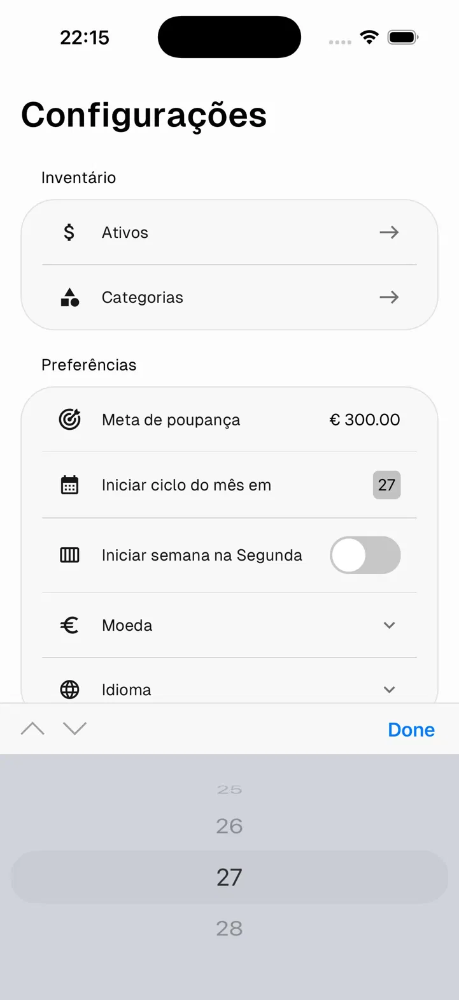

# Ciclo Mensal

O ciclo mensal define **quando o teu mês financeiro começa e termina**. Normalmente, a maioria das aplicações usa meses de calendário (do dia 1 ao 31) — mas isso raramente corresponde à forma como as pessoas recebem ou gerem o dinheiro.

No Numeroo, podes definir qualquer dia do mês como início do ciclo. Todas as partes da aplicação — estatísticas, ritmo de despesa, orçamentos, totais do ecrã inicial — respeitam esta data.

> Por exemplo, se definires o ciclo para começar no dia **27**, o teu mês vai do dia 27 de um mês ao dia 26 do mês seguinte.

---

## Definir o dia de início do ciclo

Vai a **Configurações → Preferências → Iniciar ciclo do mês em**.

Desliza o seletor para escolher o dia em que o teu mês financeiro começa.

Toca em **Done** para confirmar.

---

## Iniciar semana na Segunda

Também nas Preferências, podes ativar **Iniciar semana na Segunda** para alinhar os limites de despesa semanal e as estatísticas com o dia de início de semana da tua preferência.