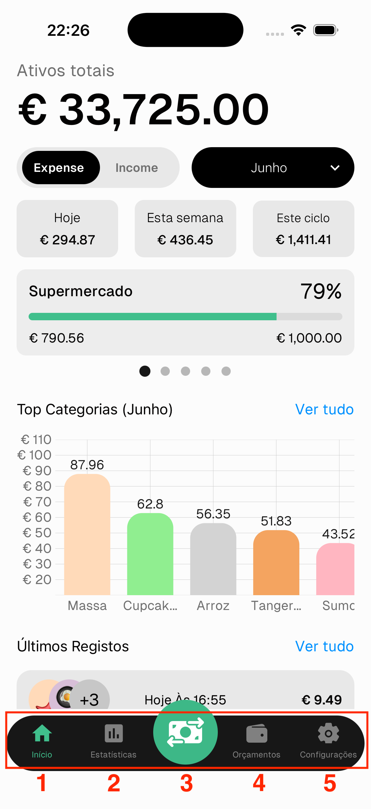

# Navegação

1. **Início** — o teu painel financeiro
2. **Estatísticas** — ritmo de despesa, tendências e gráficos
3. **Adicionar** — digitalizar um recibo com IA ou adicionar um registo manualmente
4. **Orçamentos** — gerir e monitorizar orçamentos por categoria
5. **Configurações** — conta, ativos, categorias e preferências

---

## Ecrã Inicial

- **Ativos totais** — soma de todos os teus ativos
- **Toggle Despesa / Renda** — alterna entre ver despesas ou rendimentos no período selecionado
- **Intervalo de datas** — filtra por este ciclo, este mês, intervalo personalizado, etc.
- **Resumo de Despesa/Renda** — ao ver o mês atual, mostra os totais de hoje, esta semana e este ciclo. Para intervalos personalizados ou ciclos anteriores, mostra um único total para o período selecionado
- **Cartões de orçamento** — cartões deslizáveis com despesa vs orçamento por categoria. Barra vermelha significa orçamento excedido ⚠️
- **Top Categorias** — gráfico de barras das categorias com mais despesa. Toca em **Ver tudo** para a lista completa
- **Últimos Registos** — os teus registos mais recentes. Toca em **Ver tudo** para ver tudo