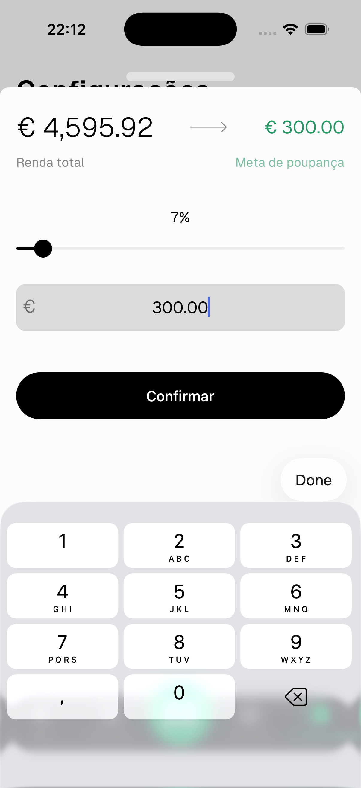

# Meta de Poupança

A meta de poupança é o valor mínimo que queres poupar em cada ciclo. Alimenta os cálculos do **Ritmo de Despesa** nas Estatísticas, mostrando se estás no bom caminho para a atingir.

---

## Definir a meta de poupança

Vai a **Configurações → Preferências → Meta de Poupança**.

- **Slider** — arrasta para definir a meta como percentagem do teu rendimento total
- **Campo de valor** — escreve um valor específico diretamente

A percentagem e o valor atualizam juntos em tempo real.

Toca em **Confirmar** para guardar.