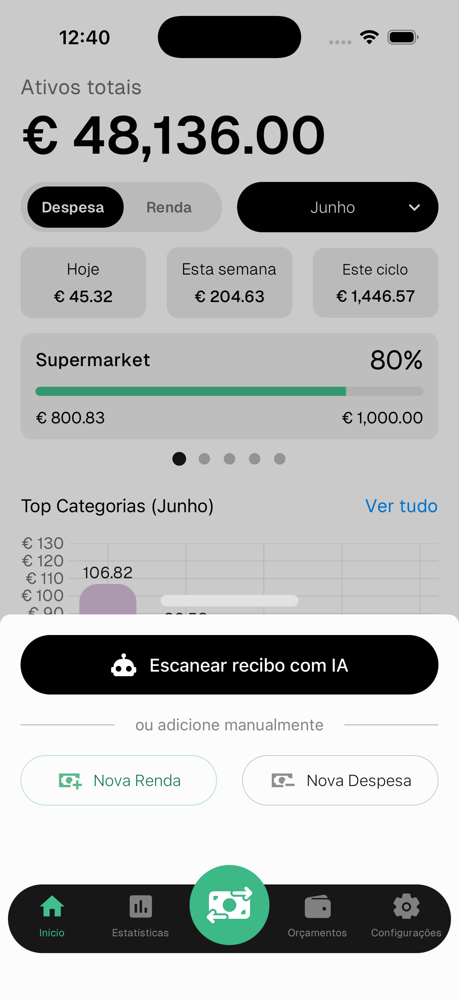
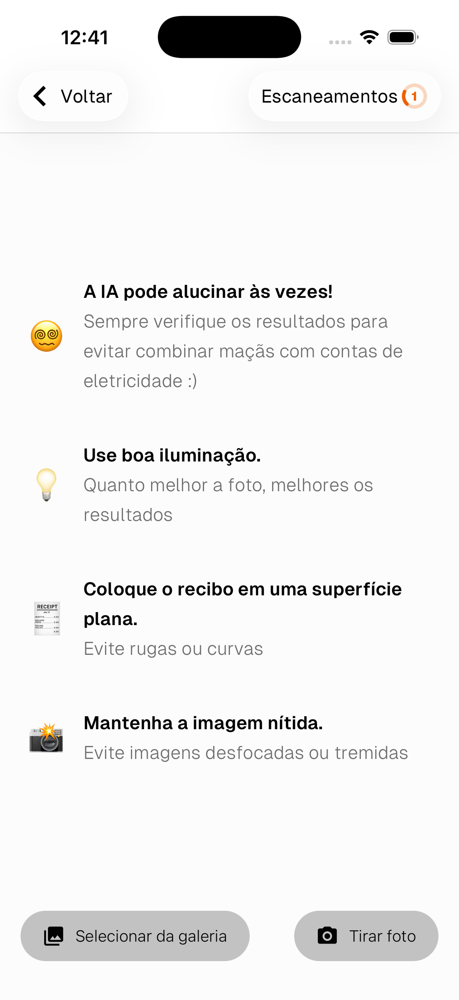
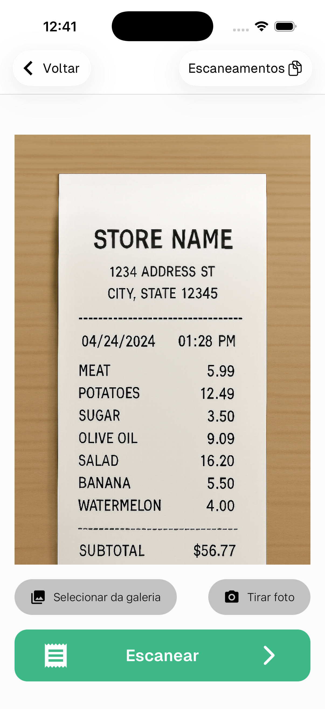
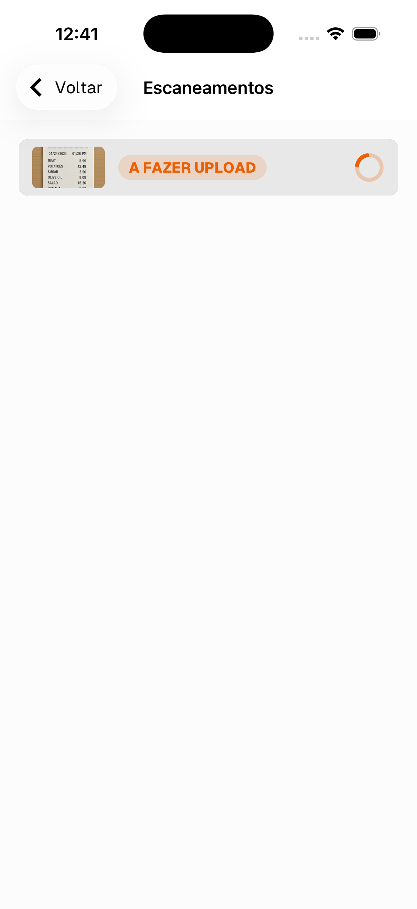
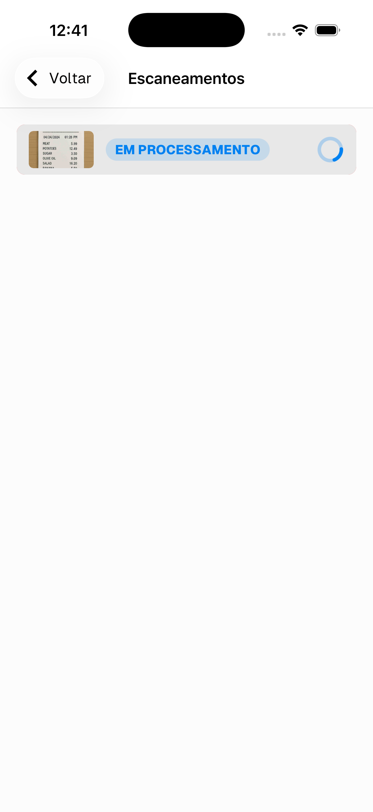
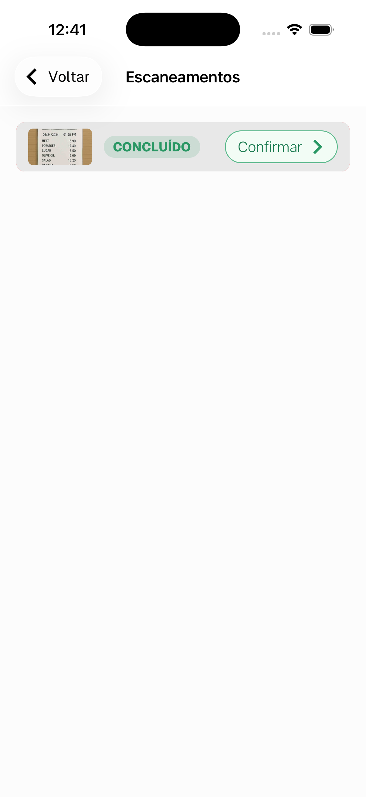
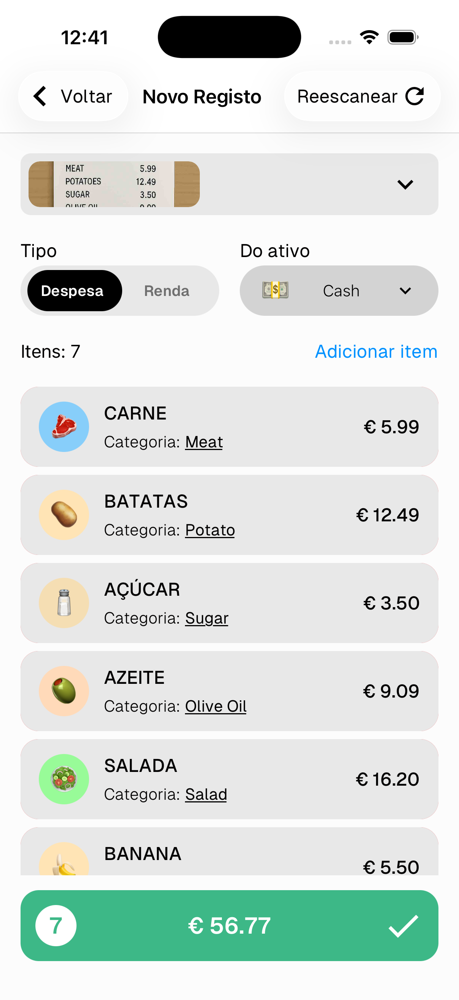
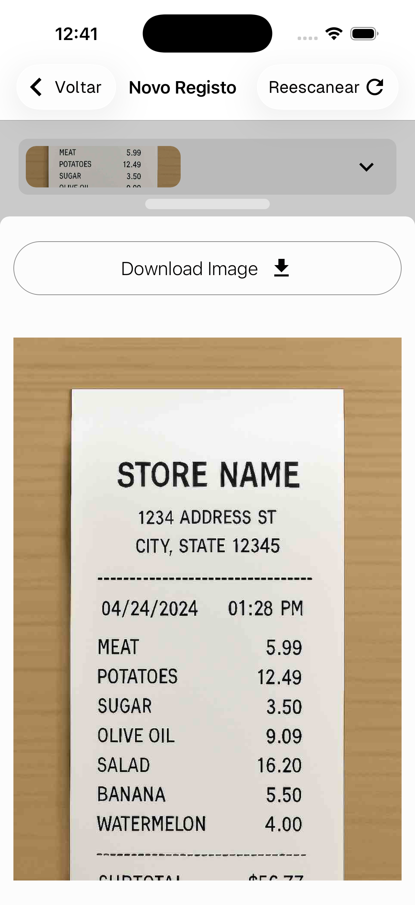

# Digitalizar Recibo com IA

O Numeroo consegue ler a foto de um recibo e extrair automaticamente todos os itens e valores, poupando-te de os introduzir manualmente.

---

## Iniciar uma digitalização

1. Toca no **botão verde ⇄** no centro da barra inferior
2. Toca em **Escanear recibo com IA**

---

## Tirar ou escolher uma foto

- Toca em **Tirar foto** para usar a câmara
- Toca em **Escolher da galeria** para selecionar uma foto existente

> 😵 A IA pode alucinar às vezes — verifica sempre os resultados
> 💡 Usa boa iluminação — quanto melhor a foto, melhores os resultados
> 🧾 Coloca o recibo numa superfície plana — evita vincos ou curvas
> 📷 Mantém a imagem nítida — evita imagens desfocadas ou tremidas

---

## Rever antes de digitalizar

Quando uma foto é selecionada aparece em pré-visualização. Toca em **Digitalizar →** para a enviar para a IA.

---

## Processamento

O recibo passa por duas fases — **A carregar** e depois **A processar**. Podes fechar a aplicação e voltar — a digitalização corre em segundo plano.

> Toca em **Digitalizações** no canto superior direito a qualquer momento para verificar o estado das digitalizações pendentes.

---

## Confirmar os resultados

Quando a digitalização estiver **Concluída**, toca em **Confirmar →** para rever os itens extraídos.

---

## Rever e guardar

A IA extrai todos os itens do recibo e associa-os automaticamente às tuas categorias. Podes:

- Tocar em qualquer item para alterar a sua categoria ou valor
- Tocar em **Adicionar item** para adicionar um item em falta
- Deslizar para a esquerda para eliminar um item
- Tocar em **Redigitalizar** no canto superior direito se os resultados estiverem errados

Toca na **barra verde** ✓ para confirmar e definir a data.

---

## Ver o recibo original

Toca na miniatura do recibo no topo para expandir e ver a foto original a qualquer momento.