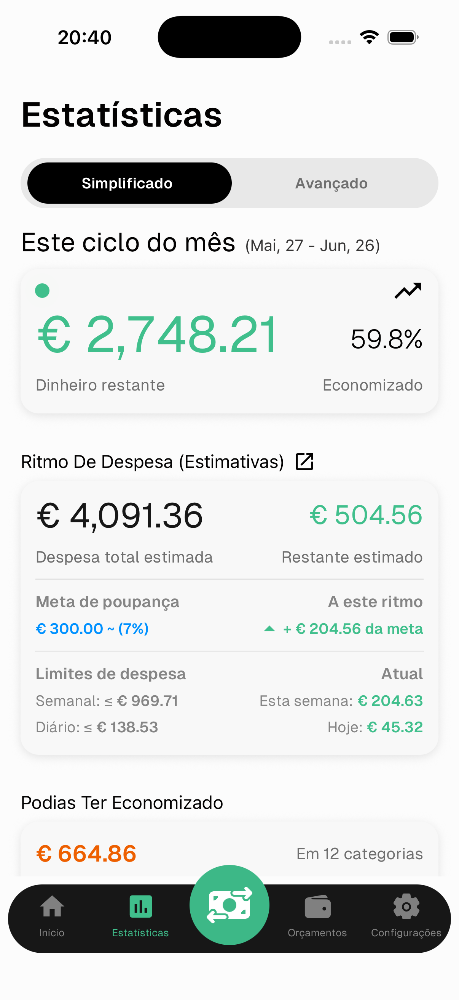
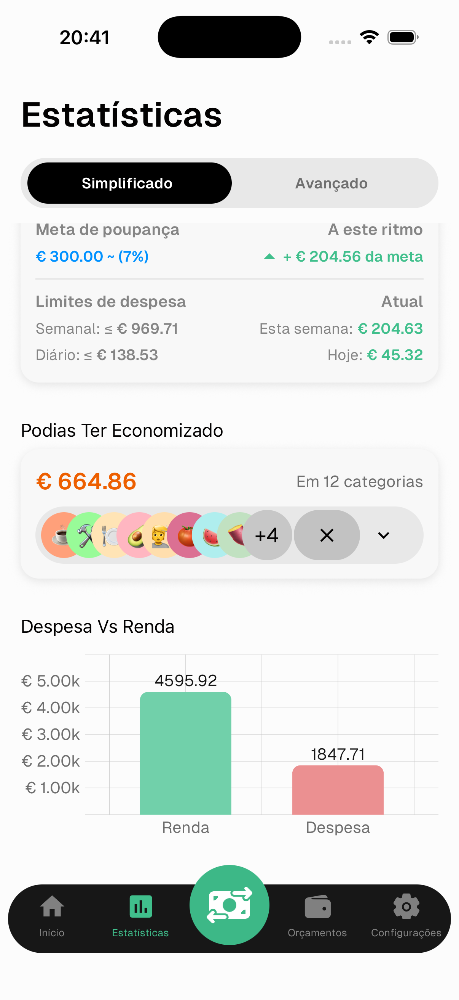
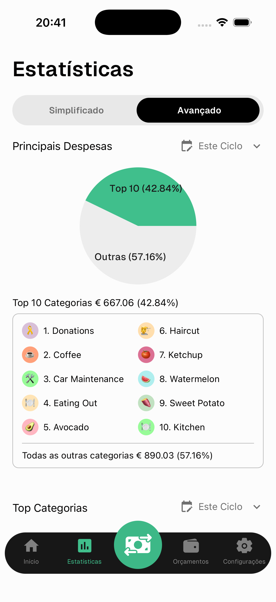
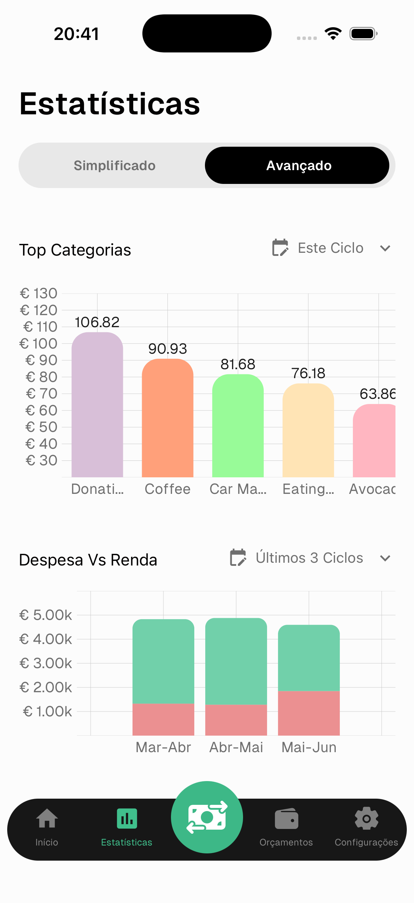

# Estatísticas

O ecrã de Estatísticas dá-te uma visão profunda da tua saúde financeira. Alterna entre **Simplificado** e **Avançado** no topo.

---

## Simplificado

### Este Ciclo do Mês

- **Dinheiro restante** — quanto te sobra depois das despesas deste ciclo
- **Economizado %** — percentagem do teu rendimento poupada até agora

### Ritmo de Despesa

A ferramenta mais poderosa do Numeroo. Com base no teu ritmo de despesa atual, estima como o resto do mês vai correr.

- **Despesa total estimada** — projeção de gastos até ao fim do ciclo
- **Restante estimado** — dinheiro previsto para sobrar
- **Meta de poupança** — o teu objetivo e se estás no bom caminho
- **A este ritmo** — quanto acima ou abaixo da tua meta de poupança ficarás se continuares a gastar a este ritmo
- **Limites semanal / diário** — o máximo que deves gastar para ficares no bom caminho
- **Esta semana / Hoje** — o que gastaste de facto

> Verde significa que estás à frente do teu objetivo. Vermelho significa que estás a gastar demasiado.

---

### Podias Ter Economizado

Mostra quanto podias ter poupado com base na despesa média das tuas categorias principais. Toca na seta para expandir e ver quais as categorias com margem para reduzir.

### Despesa Vs Renda

Um gráfico de barras que compara as tuas despesas e rendimentos totais para o período selecionado.

---

## Avançado

### Principais Despesas

Um gráfico circular que mostra as tuas top 10 categorias vs todas as outras. Usa o filtro de datas para alterar o período.

### Top Categorias

Um gráfico de barras das categorias com maior despesa para o período selecionado.

---

### Despesa Vs Renda

Um gráfico de barras empilhadas que compara despesas e rendimentos nos últimos 6 ciclos. Útil para identificar tendências ao longo do tempo.