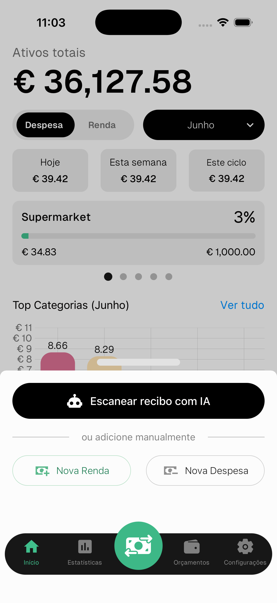
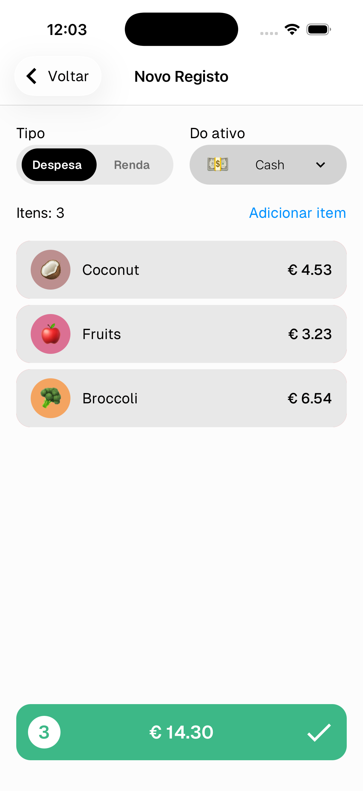
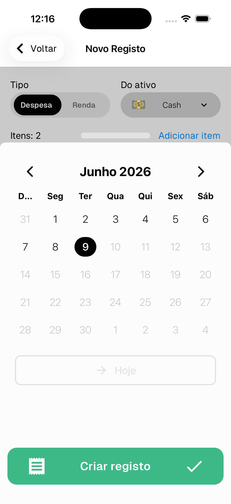
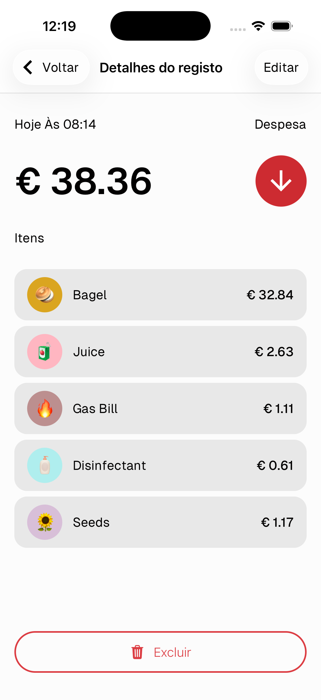
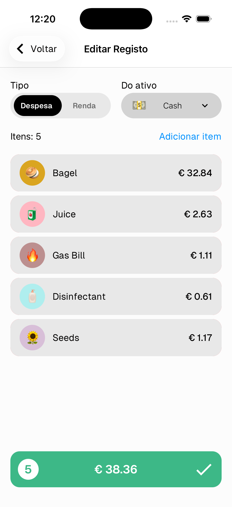
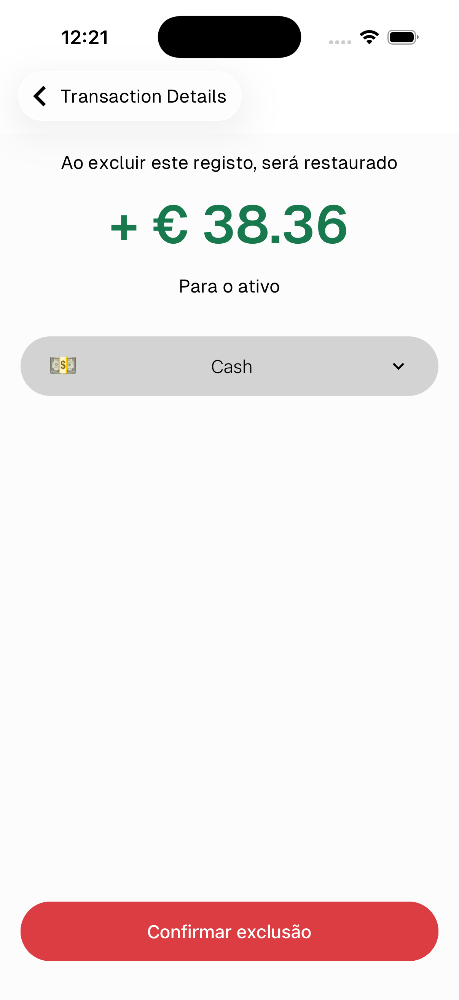

# Transações

Um registo é uma entrada de dinheiro a sair (despesa) ou a entrar (renda). Cada registo contém um ou mais itens, cada um atribuído a uma categoria.

> Para criar um registo digitalizando um recibo, consulta o guia [Digitalizar Recibo](#).

---

## Criar um registo

1. Toca no **botão verde ⇄** no centro da barra inferior
2. Escolhe **Nova Despesa** ou **Nova Renda**

---

## Adicionar itens

1. Seleciona o **tipo** (Despesa ou Renda) e o **ativo** de onde vem
2. Toca em **Adicionar item** para adicionar um item
3. Seleciona uma **categoria** e introduz o **valor**
4. Repete para vários itens — cada item pode ter a sua própria categoria

> Desliza para a esquerda num item para o eliminar

---

## Confirmar e definir a data

1. Toca na **barra verde** no fundo com o total
2. Escolhe a **data** — toca em **Hoje** para selecionar rapidamente o dia de hoje
3. Toca em **Criar registo** ✓

---

## Ver detalhes

Toca em qualquer registo no ecrã inicial ou na lista de registos para ver os detalhes completos — data, tipo, ativo, todos os itens e as suas categorias.

- Toca em **Editar** no canto superior direito para editar o registo
- Toca em **Excluir** no fundo para o eliminar

---

## Editar um registo

O ecrã de edição funciona da mesma forma que o de criação — podes alterar o tipo, o ativo, adicionar ou remover itens e os seus valores.

> Alterar o tipo (Despesa ↔ Renda) irá remover todos os itens atuais, pois as categorias são específicas por tipo.

Toca na **barra verde** ✓ para guardar as alterações.

---

## Eliminar um registo

Toca em **Excluir** no fundo dos detalhes do registo.

O valor será automaticamente restaurado no teu ativo ao eliminar.

Toca em **Confirmar exclusão** para continuar.